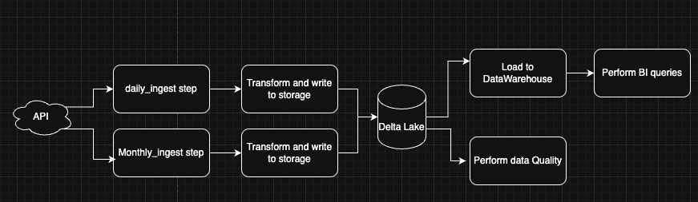

# Energy Case Study

Process data from energy API, 
- Public power data : daily ingestion 
- Price data : daily ingestion  
- Installed power: monthly ingestion 
# General steps

## To run the pipeline

```bash
# 1. Clone the repository
git clone https://github.com/deba46/energy-proj.git

# 2. Navigate into the project
cd energy-proj
# 3. Create a python venv with py version >= 3.11 and install packages from req file
# 4. For easy use added jar files in jars/  , if want to download , pls change code 
# 5. Please make sure JAVA_HOME is set, if any issues add it manually 
# 6. Run bash, frequency of daily or monthly ingest in the bash script (edit script to change freq etc.)
# 7. Notebook Output - can be viewed from output/ folder
sh run_etl.sh
